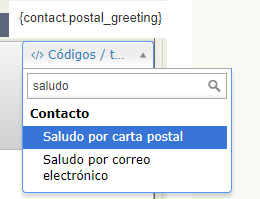

Comunicacions per correu postal
===============================

Aquest capítol tracta les diferents maneres en que CiviCRM ajuda amb el correu postal i les campanyes de correu postal. Us serà d'ajuda si teniu coneixements sòlids en funcions de cerca en el CiviCRM, com també de camps personalitzats, activitats, perfils i com realitzar combinacions de correspondència utilitzant eines de processament de text.

Planificació de l'enviament de correu
-------------------------------------

Abans de començar qualsevol activitat de comunicació, preneu-vos el temps per identificar els objectius i planificar els passos a seguir. Pel als nostres propòsits, hi ha algunes qüestions claus a fer-se abans d'enviar els correus postals.

-   Quin tipus d'enviament de correu enviareu als vostres constituents?
-   Els enviaments de correu s'enviaran sempre a tothom que es trobi a la base de dades o es dirigiran freqüentment a un seleccionat grup de contactes?
-   Com us voleu adreçar als destinataris (p.ex "Estimada Jane" o "Estimada Jane
    Doe")?

Hi ha tres maneres en que podeu utilitzar el CiviCRM per als enviaments postals:

1.  Generació d'etiquetes: imprimiu etiquets d'adreces estàndards quan no hagueu de personalitzar el contingut, per exemple per enviar una fulletó imprès.
2.  Exportació de contactes i combinació de correspondència mitjançant una eina externa (com ara LibreOffice o Microsoft Word). Consulteu el capítol sobre Exportació anterior a aquesta secció per instruccions detallades d'exportació.
3.  Utilització de la funció Impressió de cartes PDF de CiviCRM per fer la combinació directament en el CiviCRM (vegeu més a vall per saber més).

Moltes organitzacions no lucratives dels Estats Units necessiten organitzar els destinataris d'un enviament de correus en funció del codi postal per propòsits d'enviaments massius. Si això també succeeix a la vostra organització, és recomanable que creeu les etiquetes per l'enviament utilitzant un processador de textos on pugueu controlar l'ordre de classificació, en comptes que ho faci el CiviCRM. Podeu utilitzar el mateix full de càlcul per a la combinació de correspondència.

Salutacions
-----------

Podeu configurar un format de salutació postal específica per a cada contacte. Hi ha diverses opcions des de les més informals com "Estimat John", fins a les més formals com "Benvolgut Sr. John Doe". També podeu introduir una *salutació personalitzada* ("Molt honorable"). Les salutacions postals es poden editar en la secció de Preferències de comunicación del formulari d'edició del contacte. Si necessiteu definir o reiniciar les salutacions postals massivament, consulteu el capítol *Tasques Programades* en aquesta secció i la documentació a la wiki a:

[http://wiki.civicrm.org/confluence/display/CRMDOC/Update+Greetings+and+Address+Data+for+Contacts](http://wiki.civicrm.org/confluence/display/CRMDOC/Update+Greetings+and+Address+Data+for+Contacts)

Impressió de cartes PDF
-----------------------

El flux de treball consisteix en primer lloc en seleccionar els contactes als quals us voleu dirigir, per després imprimir una carta com una acció en lot. Les cartes seran emeses en format PDF, permetent-vos imprimir-les fàcilment.

Per crear la carta:

1.  Aneu a **Cerca > Cerca contactes o Cerca > Cerca avançada**; si el que voleu és imprimir cartes per a membres o per algun grup, aneu a **Contactes > Gestiona grups** i cliqueu a "Contactes" al costat del grup en qüestió.
2.  Inseriu el criteri de cerca i cliqueu Cerca (no és aplicable si utilitzeu un grup).
3.  Seleccioneu els contactes que voleu que rebin la carta.
4.  Des de les accions del menú desplegable, escolliu "Imprimeix una carta PDF per als contactes".
5.  Reviseu les seleccions al Format de pàgina i realitzeu els ajustos necessaris. Aquí és on definireu la mida de la pàgina, els marges i l'orientació de la pàgina.
6.  Inseriu el text i realitzeu ajustos de format en l'editor WYSIWYG. Podeu també inserir fitxers d'imatge com ara el logotip de la vostra organització o una signatura. Cliqueu en el cos de la carta allà on vulgueu que aparegui la imatge i cliqueu a la icona de la imatge. 
7.  Podeu personalitzar la carta utilitzant tokens; per exemple, Salutacions postals és un token que s'utilitza comunment per a aquestes situacions. Cliqueu en el cos de la carta on vulgueu que s'insereixi el token. Després cliqueu a "Insereix tokens" ubiat sobre de la carta a dalt a la dreta i seleccione el token que necessiteu.

    

8.  Abans de continuar a la següent pantalla, decidiu si el format de la carta s'ha d'utilitzar en alguna altra ocasió. En cas afirmatiu, marqueu casella Desa com a una nova plantilla i introduïu un nom en el camp Títol de la plantilla.
9.  Quan la vostra carta estigui finalitzada, desplaceu-vos fins al peu de la pàgina i cliqueu a Crea les cartes PDF.
10. Una finestra emergent us oferirà l'opció d'obrir o desar el PDF (aquesta és la mateixa notificació que el vostre navegador us ofereix per a qualsevol descarga). Obriu el fiter, reviseu les cartes i finalment imprimiu-les o bé deseu el PDF i reviseu-lo quan us vagi bé.

Podeu utilitzar aquesta característica per qualsevol tipus de document, no només cartes. Per exemple, podeu utilitzar-lo per a imprimir certificats d'assistència d'un taller.

Genereu etiquetes de correu
---------------------------

Generar etiquetes de correu és una funcionalitat molt senzilla i útil.

1.  Feu la cerca per seleccionar els contactes als quals us vulgueu dirigir.
2.  Escolliu **Etiquetes de correu** des del menú desplegable **Accions**.
3.  Seleccioneu l'estil etiqueta de correu.
4.  Determineu si voleu excloure a gent que tingui marcada l'opció "No enviar correus postals" en les seves opcions de privacitat (marcat per defecte i recomanat), i si voleu combinar qualsevol registre amb la mateixa adreça de correu postal en una única etiqueta.

Aquesta darrera opció és molt útil quan esteu fent un enviant de correus a llars o organitzacions on no voleu que rebin correus duplicats. Quan els registres es combinen, cada nom amb la mateixa adreça es llista en una línia separada en l'etiqueta.

L'administrador del sistema pot configurar els camps que s'inclouen en les etiquetes de correu. Llegiu la informació de configuració de les opcions d'adreces en el capítol de Contactes per saber més pel que fa a aquestes opcions.
