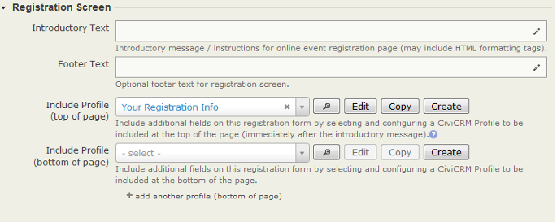
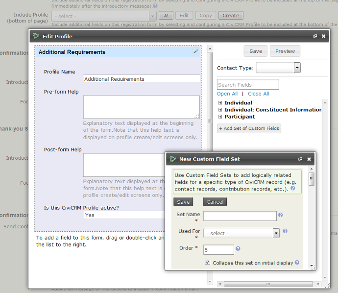
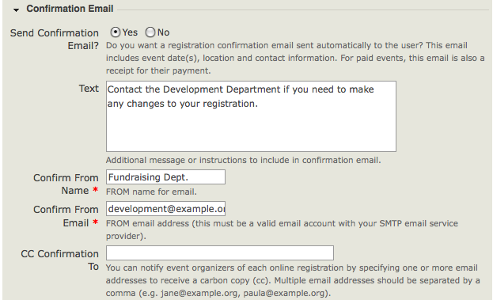
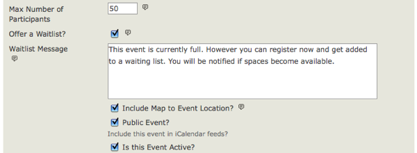
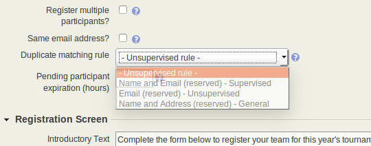

Inscripcions en línia d'esdeveniments (untraslated)
=====================================

The ability for end-users to register themselves for events is
beneficial for both your constituents - they can register and a time and
in a place that is convenient for them - and for your organization -
reducing administration. This chapter details the steps involved in
offering online registration for events.

The standard flow for registering for an event is as follows:

Setting up online registration
------------------------------

To offer online registration, check **Allow Online Registration** in the
Online Registration step of event creation and use the options on this
form to configure this feature.

Define the text to be used as the **link** from the event information
page to the registration form, and set the starting and ending dates for
registration. The link text is used in the event information page, and
is most commonly "Register Now" or similar. The start and end dates
define when web site visitors may register for the event. The
registration end date may be different from the start date of the event,
as you may want to close registration in advance of the event in order
to prepare name tags or perform other administrative functions.

Enabling **Register multiple participants** lets individuals register as
many people as they choose for the event and pay the fees with a single
transaction. For example, an organisation may be sending multiple people
to a conference, or an individual may bring their partner and wish to
register and pay for both in a single process. By default, this option
requires a different name and email address for each person registered.

Checking **same email address** provides the same capabilities, but
without requiring distinct email addresses for each registrant. In
either case, CiviCRM uses a separate contact record (an existing one if
the contact is already in the system, otherwise a new one is created)
for each individual registered.

Information on the **Duplicate matching rule** is provided in the
*Contact matching and duplicate management* sub-section of this chapter
(below).

**Pending participant expiration (hours)** is the time for
confirming/finishing registration by participants with any of the
statuses classed as **Pending**. It works in conjunction with the
scheduled job **Update Participant Statuses** (see **Administer >
System Setting > Scheduled jobs**). If these are both set, pending
registration must be finalized within the set time or the registration
will be cancelled and the would-be registrant notified by email of the
cancellation. This feature is very useful when combined with scheduled
reminders for automatically managing **Pending from pay later**
registrations if you have allowed that payment option on your online
registration page. (See the *Email* section for more details on
scheduled reminders)

The next step is to define the text and the fields for collecting
information that will be displayed on your online registration page.

The introductory text comes at the top of the page and the footer text
at the bottom. In between will come some, or all, of: profile, fee
selection, credit card details, additional profile(s) in that order.

Collecting participant information with profiles
-------------------------------------------------

The best way to collect information during online registration is to
include one or more profiles in your event configuration.You can include
one profile immediately after the introductory message and one or more
profiles under any fees and payment details you need to collect. (If
you are not sure what a profile is and why you would use them see the
*Profiles* chapter of *Organising you data*.)

By default, when creating an online registration form the profile "Your
Registration Info" will be selected as the 'top' profile. This consists
of three fields: first name, last name and email address. However,
CiviCRM only requires either first name and last name or email address
for each contact. So you can modify 'Your Registration Info' or create a
new profile with fewer fields. If you choose not to collect email
addresses, be sure to uncheck the option "Send confirmation email?" at
the bottom!

WARNING: If you modify an existing profile whilst configuring your
Online Registration page, the changes you make will apply everywhere
that profile is being used. So unless an existing profile **exactly**
matches your requirements you should copy the profile, then rename and
edit the copy as required.

If the profile you require does not already exist, you can create it
without leaving the Online Registration configuration page. The drag and
drop profile interface also allows you to create custom fields to
include in the profile if you have not already done so. Custom fields
can be created for all events or all participants, or only specific
Event Types or Participant Roles (see the chapter *Custom data on
events* in this section for more details on where you should store what
custom data).

It is highly recommended that if you are charging for your event that you include a CPATCHA (reCAPTCHA in the case of CiviCRM).  You can add reCAPTCHA to a profile you include and it will be included on the Online Registration page.  

For more information read [Profiles](../organising-your-data/profiles).

Registration confirmation
--------------------------

Once you registration page is configured you need to enter the text to
be displayed on the Confirmation page, Thank-you page, and emailed
confirmations/receipts (if enabled).

For free events, the Confirmation step is skipped. For paid events the
payment is processed between the Confirmation and Thank you pages.

For most events you'll want to enable the Send Confirmation Email
feature (see following screenshot). For paid events, the confirmation
email also acts as a receipt. Make sure that the **Confirm From Email**
address entered is a valid email account on your mail server. Add one or
more staff emails (separating multiple email addresses with commas) to
the **CC Confirmation To** field if you want real-time updates on who is
registering for your event.

Please note that the contents of the **Text** field will be included in
both TEXT and HTML versions of receipt emails so we do not recommend
including HTML tags / formatting here.

Optional event registration features
------------------------------------

The following features may be useful to enhance your online event
registration process.

### Waitlists

Your organization may have limits on attendance, such as a 25-person
limit for a training workshop or a 200-person limit for a fund-raising
dinner. CiviEvent lets you set the maximum number of people allowed to
register for your event. When registrations reach that number, CiviEvent
will not allow other people to register, but will instead send an
automatic message saying, "The event is currently full." This message
can be customized by the organization when creating a new event, and you
can let people add themselves on a first-come-first-served basis to a
waitlist.

The waiting list works in the following way:

-   As space becomes available on your event, for example, if one or
    more people cancels, then On waitlist participants will be moved to
    'Pending from waitlist' status and will be sent an email with a link
    to complete their registration (including paying event fees - if
    any).
-   People will remain pending for a certain amount of time defined in
    Pending participant expiration (hours). This gives them a window of
    opportunity to register.
    You can set the amount of time, measured in hours, that you set on
    the **Online registration** tab under Pending participant expiration
    hours. If you want, you can set this to 0 for no limit.
-   After this period of time, they will be moved to expired and other
    people on the waitlist will be given the opportunity to register.

If you'd like to enable the Waitlist feature, you must first enable the
related participant statuses **On waitlist** and **Pending from
waitlist**. You can do this in **Administer > CiviEvent > Participant
statuses**. You can then check the **Offer Waitlist** checkbox on
the **Info and settings** tab, and set the message you want displayed on
the event information page when the event is full.

Note that in order for the status processing to happen, you need to have
the **Update Participant Statuses** scheduled job
running (see **Administer > System Setting > Scheduled jobs**).

### Participant approval

Many events are open to everyone, but there may be times when your
organization invites only specific people to the event. For example, you
could invite volunteers who have donated 100 or more volunteer hours to
an appreciation dinner. The people invited may talk about the event to
their friends, and possibly forward the information. With CiviEvent, you
can check who has registered and approve only the people invited.

If you'd like to enable the 'Participant approval' feature, you must
first enable the related participant statuses **Awaiting approval**,
**Pending from approval** and **Rejected**. This is similar to what you do for waiting lists
and you can do it in **Administer > CiviEvent > Participant
Statuses**. You can then check the **Require participant
approval?** checkbox on the **Online Registration** tab, and set the
message you want displayed in the approval message. You can also limit
the amount of time participants have to complete their registration
after approval by entering the time in hours in the Pending participant
expiration field. For example, if you want to give participants 3 days
to complete their registration, enter "72" in that field.

Now, when a person registers for the event, they will get a reply that
says, "Your registration has been submitted. Once your registration has
been reviewed, you will receive an email with a link to a web page where
you can complete the registration process." This reply can be customized
to your organisation's needs.

Participants will be placed in 'Awaiting Approval' status. You can
review and approve participants from 'Find Participants' - select the
'Change Participant Status' task. Approved participants will move to
'Pending from approval' status, and will be sent an email with a link to
complete their registration (including paying event fees - if any)

Note that in order for the status processing to happen, you need to have
the **Update Participant Statuses** scheduled job running
(see **Administer > System Setting > Scheduled jobs**).

### Personal Campaign Pages

If you enable Personal Campaign Pages (PCPs), you offer completed event
registrants the ability to create and customize a page of their own to
either:

-   promote the event for which they registered

-   promote an online contribution page

For more information see **Contributions > Personal Campaign Pages** in
this book. This is the last step in creating an event. Click **Save and
Done.**

Contact matching and duplicate management
------------------------------------------

Whenever we allow people to interact with our database from 'the
outside' we run the risk of creating duplicate contacts. There are
various ways to deal with this. For example, some websites require you
to be logged in at all times when doing important things and we can do
the same for CiviCRM using permissions (just take away the register for
events permission from anonymous users and give it to logged in users,
or a specific role). Depending on the type of event that you are
running, this might not be a good idea. Lets say you are running a
conference, or AGM and you want as many people as possible to register.
Requiring them to log in wil decrease the amount of registrations.

Lets say, we don't require people to log in to register for an event.
Consider the following situation. James Martin registers for an event.
James Martin is already in our database. How do we match up the James
who is registering with the one that is in the database. What about if
there are two James Martins in our database. One that lives in London,
and one that lives in Paris. How do we know that we have found the right
one? The answer is duplicate rules.

You can read more general and more detailed information about duplicates
and merging in the *Deduping and merging* chapter and we recommend that
you get familiar with that chapter at some point. This section just
covers contact matching and duplicate management in the context of
CiviEvent.

By default, CiviEvent uses the Unsupervised rule to do matching. When
you configure an event for online registration, you can override the
default by selecting a different duplicate matching rule for matching
participants for this particular event. The rule you select takes effect
for the primary participant and any additional participants.

The Online Registration tab checks for whether the included profiles
have enough fields to have a chance at matching participants to existing
contacts. It reviews the possible combinations of matching fields that
would satisfy the matching rule in effect for the event, and it checks
to see if any of those combinations is present among the fields in the
included profiles. The warning "Duplicate Matching Impossible" appears
if there's no way to match duplicate contacts using the rule, while the
warning "Duplicate Contacts Possible" appears if enough fields are there
but not all of them are required.

Registration permissions
-------------------------

If you've enabled online registration for events on your site you need
to review the Drupal user permissions to ensure that visitors are able
to view event information and complete the registration forms. Navigate
to **Administer > Users > Permissions**.

Most organizations allow anonymous users (users who have not logged in)
to view and register for events. If you want to allow this, you must
assign the following CiviCRM module permissions for the anonymous user
role:

-   access all custom data - required if you are collecting information
    in custom fields from registrants
-   profile create - required if you've included any profiles in your
    online registration forms
-   register for events
-   view event info
-   view event participants - required if you want to display a listing
    of registered participants.

If you want to exclude anonymous visitors from viewing or registering
online for events, assign these permissions to an authenticated user
role.

CiviCRM has an additional permissioning system known as Access Control
Lists (ACLs) ACLs allow you control access to CiviCRM data. Note that a
CiviCRM ACL Role is not related to the Drupal Role. Refer to the
*Permissions and access control* chapter for more information.

If you need to limit access control for specific events, you can use the
Manage Access Control feature to assign access to specific groups of
contacts.

Testing the registration process
--------------------------------

Before revealing your event to the public, you should always test the
event registration process. This can be done as follows:

1.  Navigate to **Events > Manage Events**.
2.  From Event Links, select **Test-drive** to test the registration
    page. Test-drive mode will use the sandbox options for your payment
    processor, if available, and will create a registrant record with a
    test indication so that it can be reviewed and easily removed.
3.  Fill out the registration form and complete the registration
    process.
4.  In order to find the new test participant record, navigate
    to **Events > Find Participants**.
5.  In the search criteria, check the box **Find Test Participants**.
6.  If you need to adjust the event settings, navigate to **Events > Manage Events** and click the **Configure** link for this event.
7.  If you discover elements that you need to edit and adjust,
    select **Configure** to return to the list of event setting pages.
8.  If you have events where anonymous users register for events, you
    should also test the registration when not logged in. Refer to the
    Event Permissions information later in this chapter for details.

Once you are satisfied with the event information and registration form,
it's time to display it on your website. Below are details of how to do
this.
